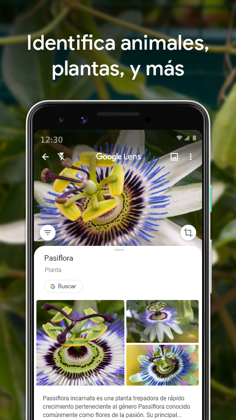

# PEC3 – Manovich Reloaded: Amazon Go y BeReal como híbridos contemporáneos  
### Grado de Multimedia - UOC (2025)
### 20.644 - Cultura Digital (Aula 1)
Alumno: Mariano Marijuán Ruiz

---

## Índice
1. [Introducción](#introducción)  
2. [Caso 1: Amazon Go – Cuando la tienda física se convierte en un algoritmo](#caso-1-amazon-go--cuando-la-tienda-física-se-convierte-en-un-algoritmo)  
3. [Caso 2: BeReal – Autenticidad programada y temporalidad algorítmica](#caso-2-bereal--autenticidad-programada-y-temporalidad-algorítmica)  
4. [Conclusiones](#conclusiones)  
5. [Bibliografía](#bibliografía)  
6. [Declaración de uso de IA](#declaración-de-uso-de-ia)

---

# Introducción

Vivimos rodeados de medios híbridos, experiencias que mezclan lo físico y lo digital y que están apoyadas en un software diseñado para convertir las acciones cotidianas en información procesable mediante procesos automatizados. Siguiendo la tesis de Lev Manovich en *El software toma el mando* (2013), el software no solo representa sino que reorganiza nuestras prácticas culturales y fusiona antiguas formas de interacción en nuevas lógicas estructuradas por los algoritmos. 

En este ensayo exploro dos casos que ilustran esta transformación: 
- **Google Lens** es una herramienta de reconocimiento visual que permite identificar objetos, textos, plantas, animales, productos y lugares con solo apuntar la cámara de nuestro dispositivo.
- **BeReal** es una red social que anima a los usuarios a compartir imágenes de lo que estén haciendo en tiempo real. Una de sus peculiaridades es que no podremos ver las publicaciones de los demás hasta que no publiquemos la nuestra.

Mientras BeReal evidencia cómo el software reprograma la temporalidad y la autenticidad en la esfera social, Google Lens muestra cómo la percepción misma del entorno se convierte en un proceso algorítmico. En conjunto, ambos casos confirman que la hibridación no solo reorganiza nuestras prácticas sociales, sino que también reconfigura la manera en que vemos y comprendemos el mundo.

---

# Caso 1: Google Lens

*Imagen oficial de Google Lens. Fuente: Google Play.*

Google Lens constituye un caso representativo de hibridación de medios en el sentido planteado por Manovich (2013), donde distintos formatos y prácticas culturales se entrelazan bajo la lógica del software. Desde esta perspectiva, la aplicación no se limita a registrar imágenes a través de la cámara del dispositivo móvil, sino que transforma el entorno físico en datos interpretables. En este proceso confluyen la visión artificial, el acceso a bases de datos, el procesamiento del lenguaje y la realidad aumentada, generando una experiencia que redefine cómo nos relacionamos con la información visual.

A diferencia de la fotografía tradicional cuyo propósito principal era ofrecer una representación visual de la realidad, Google Lens convierte la cámara en un dispositivo de lectura e interpretación. De este modo, los objetos, textos, edificios, productos, etc. dejan de ser simples elementos visuales para presentarse como objetos procesables y datos interpretables. Por lo tanto, el mundo físico se reconfigura en una interfaz interactiva que aúna visión, datos y acción.

Desde la perspectiva de Manovich (2013), Google Lens ilustra una hibridación profunda de medios. En un solo gesto se articulan prácticas que antes permanecían separadas: la fotografía, la búsqueda en Internet, el reconocimiento de textos (OCR), la traducción automática, la cartografía y la realidad aumentada. Tal como señala el autor al definir los nuevos medios híbridos:

> “Se agrupan técnicas y formatos de representación de medios físicos y electrónicos anteriores, y las nuevas técnicas de manipulación de la información y formatos de datos exclusivos del ordenador para formar nuevas combinaciones” (Manovich, 2013, p. 214).

Esta integración no es meramente superficial, sino estructural, puesto que cada imagen capturada se transforma en una consulta dentro de una base de datos global organizada algorítmicamente.

Aceptando la idea de que el software no solo representa sino que reestructura la experiencia (transcodificación), Google Lens capta la realidad material y la traduce a la lógica del software, de modo que lo visual se transforma en texto, categorías, enlaces y resultados funcionales. En este punto, la experiencia de mirar se ve alterada porque ya no observamos únicamente para reconocer, sino para activar procesos algorítmicos. La hibridación de medios se hace evidente cuando la cámara deja de ser una herramienta pasiva y se convierte en una interfaz activa que conecta el entorno físico con capas de información digital, redefiniendo la práctica misma de mirar.

Además, el sistema introduce una dimensión de automatización cognitiva. Procesos como el reconocimiento de objetos, la traducción de textos o la identificación de lugares se ejecutan sin requerir un esfuerzo consciente por parte del usuario. Así pues, ciertas capacidades tradicionalmente humanas como son reconocer, recordar o buscar, se delegan al software que pasa a redefinir la relación entre percepción y conocimiento.

En el plano cultural, Google Lens logra transformar esas prácticas cotidianas como viajar, estudiar, comprar o aprender. Acciones que antes requerían tiempo como por ejemplo identificar una obra de arte y buscar información sobre ella, se convierten en operaciones con resultados inmediatos. Así pues, el mundo físico pasa a configurarse como un entorno de información disponible en tiempo real.

En este sentido, Google Lens no puede entenderse únicamente como una mejora de la cámara o del buscador, sino como un medio híbrido donde confluyen representación visual, procesamiento algorítmico y experiencia interactiva. La hibridación es evidente porque se trata de una reconfiguración profunda de cómo vemos, interpretamos y nos relacionamos con la realidad.

---

# Caso 2: BeReal

*Imagen oficial de BeReal. Fuente: Google Play.*

Esta red social surge como respuesta a la hiper estetización de las redes sociales. Plantea una premisa sencilla, publicar una vez al día. La app envía una notificación aleatoria y el usuario tiene dos minutos para tomar una foto simultánea con la cámara frontal y trasera del móvil. Esto que parece un gesto trivial, es en realidad una práctica profundamente híbrida.

Por un lado, BeReal retoma elementos de la fotografía tradicional como es la captura de un momento cotidiano (sin edición ni filtros). Por otro lado, introduce una lógica algorítmica que determina el **cuándo** y el **cómo** de esa captura. El usuario deja de ser quien decide el momento, es el software quien impone el tiempo de representación. Esto convierte la foto en una acción programada, un acto cultural guiado por el algoritmo.

Desde esta perspectiva, es el software el que define la temporalidad, limita la edición, controla la simultaneidad entre cámaras y dirige la interacción. La promesa de “autenticidad” está regulada por la estructura algorítmica que diseña la experiencia.

BeReal también podría entenderse como un caso de remediación, donde la fotografía clásica se integra en un ecosistema digital de inmediatez, notificación push y lógica de red. La imagen no existe como documento permanente, sino como parte de un flujo temporal que desaparece. Se mantiene la esencia del medio (la captura visual), pero bajo nuevas reglas.

Culturalmente, BeReal altera la manera en que entendemos la espontaneidad. La autenticidad ya no surge de la experiencia vivida, sino de responder a una notificación. Esto genera una forma de temporalidad algorítmica donde la vida cotidiana se sincroniza parcialmente con el software. La captura de imágenes imperfectas, tomadas desde ángulos no previstos, convierte momentos rutinarios en experiencias significativas al ser valorizados por el software. De este modo, se pone de manifiesto el concepto de hibridación, donde lo cotidiano adquiere un nuevo sentido bajo la lógica algorítmica.

BeReal no solo integra la cámara con una narrativa digital improvisada, plantea una crítica implícita al funcionamiento y uso de las otras redes sociales. Esta crítica y su correspondiente alternativa, lo plantea desde dentro del mismo ecosistema del software, reproduciendo las lógicas que pretende cuestionar tales como, las notificaciones, el uso de una gamificación ligera y la participación en la comunidad organizada por la interfaz (si no publicas, no puedes ver las publicaciones de otros).

En síntesis, BeReal transforma una práctica analógica como es el hecho de tomar fotografías de manera espontánea, en un dispositivo cultural programado, donde la autenticidad aparece como un efecto orquestado por el software.

---

# Conclusiones

Los casos de Google Lens y BeReal muestran dos formas complementarias en las que la hibridación de medios, tal como la describe Manovich, se manifiesta en la cultura digital contemporánea. En ambos ejemplos, el software no actúa únicamente como una herramienta técnica, sino como un elemento estructural que reorganiza unas prácticas culturales preexistentes.

Google Lens evidencia cómo la percepción del entorno físico se convierte en un proceso donde ver implica interpretar, traducir y acceder a capas de información mediadas algorítmicamente. BeReal por su parte, pone de relieve cómo el software programa la temporalidad y la autenticidad en el ámbito social, transformando una práctica cotidiana como la fotografía en un acto cultural regulado por la interfaz y la notificación.

En conjunto, ambos casos confirman que la hibridación no consiste solo en la suma de medios, sino en una reconfiguración profunda de la experiencia, donde lo físico, lo digital y lo cultural se integran bajo la lógica del software.

---

# Bibliografía / Webgrafía

- Manovich, L. (2013). *El software toma el mando*. Editorial UOC.

- Universitat Oberta de Catalunya. (2018). *Elementos de la creatividad multimedia: apropiación, remediación e hibridación*. Mosaic.  
https://mosaic.uoc.edu/2018/01/18/elementos-de-la-creatividad-multimedia-apropiacion-remediacion-hibridacion/

- Google. (s. f.). *Qué es Google Lens y cómo funciona*.  
https://lens.google/intl/es/howlensworks/

  - Google. (s. f.). *Google Lens* [Imagen promocional].  
https://play-lh.googleusercontent.com/swFjFbgTZ7jXLouUyhPnQ7aMnRrpq3JwyQfBuMekCKZMf-dIs8P7WErk_A0t3bRaAIT-=w5120-h2880

- BeReal. (s. f.). *Hora de BeReal*.  
https://help.bereal.com/hc/es/articles/7350386715165--Hora-de-BeReal

  - BeReal. (s. f.). *BeReal* [Imagen promocional].  
https://play-lh.googleusercontent.com/OkAN5zNbiB4jvxWYJjgZcu86YNk6BBCFZ5htR2s_-VFsT9y-eknLkLnl1K3sucJZfuo=w5120-h2880

---

# Declaración de uso de IA

